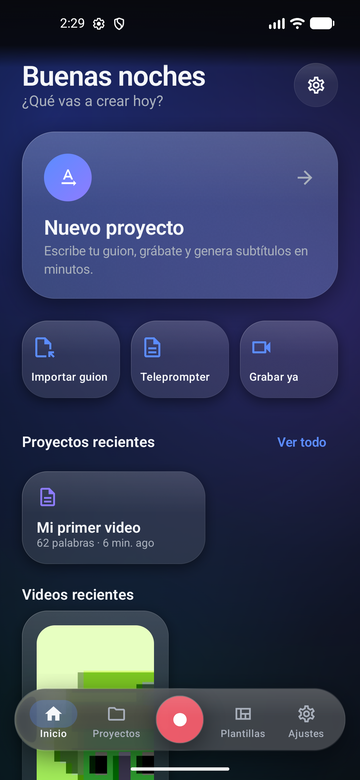
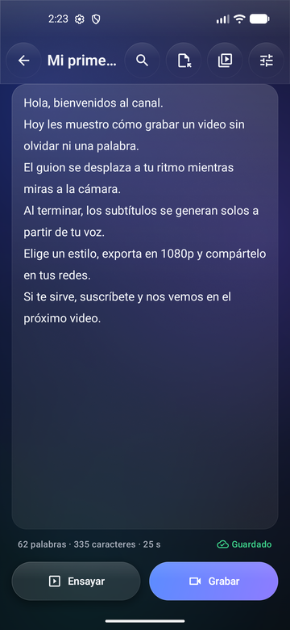
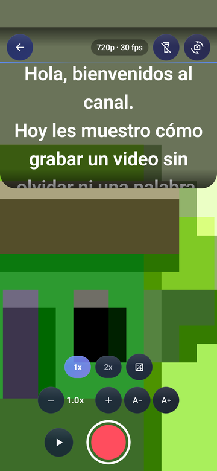
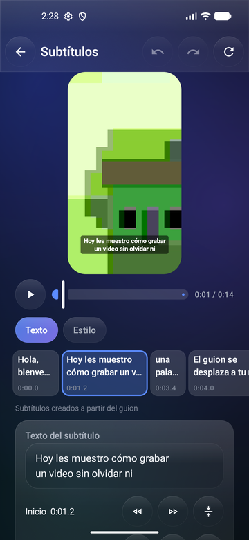
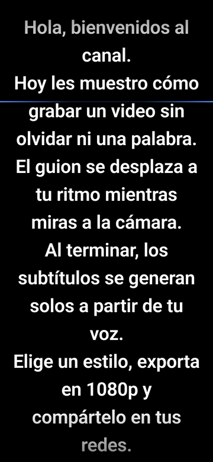
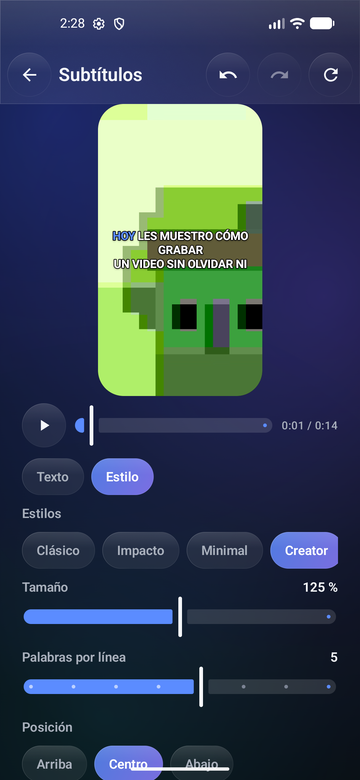
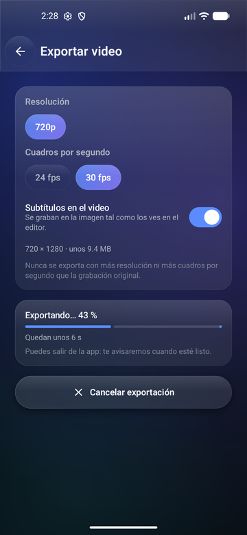
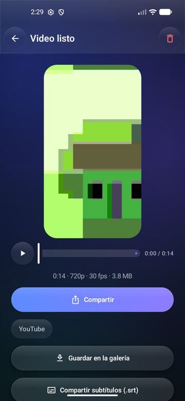
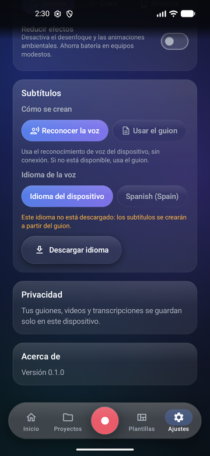
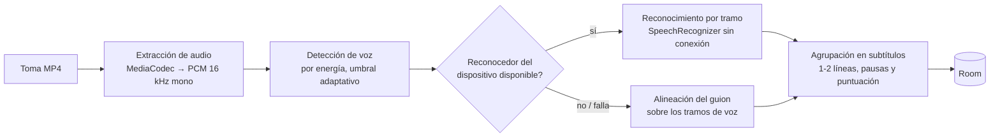

# GlassPrompt

**Teleprompter, cámara y subtítulos automáticos en una sola app Android.** Escribe tu guion, léelo mientras te grabas sin memorizar nada, deja que la app genere los subtítulos a partir de tu voz y exporta el video listo para redes, todo sin conexión y sin que tus videos salgan del teléfono.


<p align="center">
  
  
  
  
</p>

## Qué hace

**Guion**
- Proyectos con su guion, autoguardado mientras escribes, buscar y reemplazar, e importación desde `.txt` o el portapapeles.
- Plantillas de guion (tutorial, reseña, anuncio de 30 s, presentación, historia, explicación).
- Estadísticas en vivo: palabras, caracteres y tiempo estimado de lectura.

**Teleprompter y cámara**
- El texto se desplaza a un ritmo constante (1.0x ≈ 150 palabras por minuto, con cualquier tamaño de letra) con controles de velocidad, tamaño, posición, modo espejo y cuenta atrás.
- Teleprompter superpuesto a la cámara (solo en la vista previa, nunca queda en el video): grabación con pausa, zoom, enfoque, exposición, linterna y cambio de cámara.
- Solo ofrece resoluciones y fps que tu cámara admite de verdad, y graba a una tasa de bits razonable (10 Mbit/s en 1080p30) para no llenar el teléfono.

**Subtítulos automáticos**
- La transcripción empieza sola al terminar la toma y sigue en segundo plano.
- Usa el reconocimiento de voz **sin conexión** del propio teléfono (Android 13+), con marcas de tiempo por palabra en Android 14+. Si no está disponible, coloca el texto del guion sobre tu voz: siempre hay subtítulos, en cualquier dispositivo.
- Editor con línea de tiempo: corregir texto, dividir, unir, eliminar, añadir, ajustar tiempos al cursor y deshacer/rehacer.
- 7 estilos (Clásico, Impacto, Minimal, Creator, Neón, Glass, Karaoke) y animaciones: aparecer, pop, deslizar, escalar, palabra activa y karaoke.

**Exportar y compartir**
- Exporta en 720p, 1080p o 4K (si la toma lo permite) con los subtítulos grabados en la imagen, **idénticos a la vista previa**: los dos usan el mismo código de dibujo.
- Se ejecuta en segundo plano con notificación de progreso, tiempo restante y opción de cancelar.
- Guardar en la galería (`Películas/GlassPrompt`), compartir con el menú del sistema o directo a Instagram, TikTok, YouTube y WhatsApp si están instaladas, y exportar los subtítulos como `.srt`.

<p align="center">
  
  
  
  
  
</p>

## Cómo funciona la transcripción



Cada paso es un componente con pruebas unitarias. El audio se procesa por streaming, así que una toma larga no ocupa más memoria que una corta. El idioma de la voz se elige en **Ajustes → Subtítulos**, donde también se puede descargar el modelo de reconocimiento sin conexión si el teléfono aún no lo tiene.

## Tecnología

| Área | Librerías |
|---|---|
| Lenguaje y UI | Kotlin 2.4, Jetpack Compose (BOM 2026.09), Material 3, Navigation Compose con rutas tipadas |
| Arquitectura | MVVM + casos de uso, Hilt, Coroutines/Flow |
| Datos | Room 2.8 (esquemas versionados y migraciones con test), DataStore |
| Cámara | CameraX 1.6 (`camera-compose`) |
| Video | Media3 1.11: ExoPlayer, `ui-compose`, Transformer y efectos |
| Segundo plano | WorkManager con servicio en primer plano |
| Efectos visuales | Haze 2.0 (desenfoque "Liquid Glass") |
| Pruebas | JUnit 4, Truth, Turbine, MockK, coroutines-test, Room testing, Compose UI Test |

El proyecto está organizado en capas (`core` / `domain` / `data` / `feature`). La lógica que se puede probar sin Android (ritmo del teleprompter, VAD, alineación, segmentación y edición de subtítulos, animaciones, opciones de exportación) es Kotlin puro en `domain`. Las decisiones de diseño, versiones y el plan por fases están en [ARCHITECTURE.md](ARCHITECTURE.md).

## Compilar

**Requisitos**
- Android Studio 2025.3 o superior (su JBR 21 sirve como JDK), o un JDK 17+ con `JAVA_HOME` configurado.
- Android SDK con la plataforma 37 (`compileSdk 37`). La app funciona desde Android 8.0 (`minSdk 26`).

```bash
git clone https://github.com/ArnoldZamoratec/teleprompt-caption-android.git
cd teleprompt-caption-android

./gradlew assembleDebug        # APK de depuración
./gradlew installDebug         # instalar en un dispositivo conectado
```

El Gradle Wrapper descarga todo lo necesario. Android Studio crea `local.properties` con la ruta del SDK al abrir el proyecto.

## Pruebas

```bash
./gradlew testDebugUnitTest    # pruebas unitarias en la JVM
./gradlew lint                 # análisis estático
./gradlew connectedDebugAndroidTest   # pruebas instrumentadas (ver nota)
```

> **Nota:** `connectedDebugAndroidTest` desinstala la app al terminar y borra sus datos (proyectos y tomas). En un teléfono con datos reales, instala las APK con `./gradlew installDebug installDebugAndroidTest` y ejecuta una clase concreta con
> `adb shell am instrument -w -e class com.arnoldcode.glassprompt.data.MigrationTest com.arnoldcode.glassprompt.test/com.arnoldcode.glassprompt.HiltTestRunner`.

## Privacidad y permisos

La app **no pide permiso de Internet**. Guiones, videos y transcripciones se guardan solo en el almacenamiento interno del teléfono, y el reconocimiento de voz se hace en el dispositivo.

| Permiso | Para qué | Cuándo se pide |
|---|---|---|
| Cámara y micrófono | Grabar la toma y su audio | Al abrir la cámara |
| Notificaciones (Android 13+) | Progreso de la exportación (opcional) | En la primera exportación |
| Almacenamiento (solo Android 8–9) | Guardar en la galería | Al pulsar "Guardar" |

Los videos se comparten mediante `FileProvider`, que solo expone la carpeta de exportaciones y los `.srt`; las tomas originales siguen siendo privadas.

## Estado

| Fase | Contenido | Estado |
|---|---|---|
| 1–2 | Arquitectura y proyecto base | ✅ |
| 3 | Design system "Liquid Glass", onboarding y navegación | ✅ |
| 4 | Proyectos, editor de guion y plantillas | ✅ |
| 5 | Teleprompter, cámara y grabación | ✅ |
| 6 | Transcripción, editor y estilos de subtítulos | ✅ |
| 7 | Exportación, galería, compartir y `.srt` | ✅ |
| 8 | Completar las suites de pruebas de integración e interfaz | ⏳ |
| 9 | Rendimiento (Baseline Profile), accesibilidad y R8 | ⏳ |
| 10 | Build de release firmado | ⏳ |

Probado en un Samsung Galaxy A24 (Android 16) y en el emulador. Las capturas de este README son del emulador, cuya cámara virtual muestra una escena de prueba.

**Limitaciones conocidas**
- El reconocimiento sin conexión puede confundir nombres propios y siglas. Para eso está el editor de subtítulos.
- La prueba instrumentada `RecordingFlowTest` falla por una incompatibilidad del entorno de pruebas de Compose con el reproductor de Media3; se resolverá en la fase 8.

## Autor

Arnold · [@ArnoldZamoratec](https://github.com/ArnoldZamoratec)

Este proyecto todavía no tiene una licencia definida.
